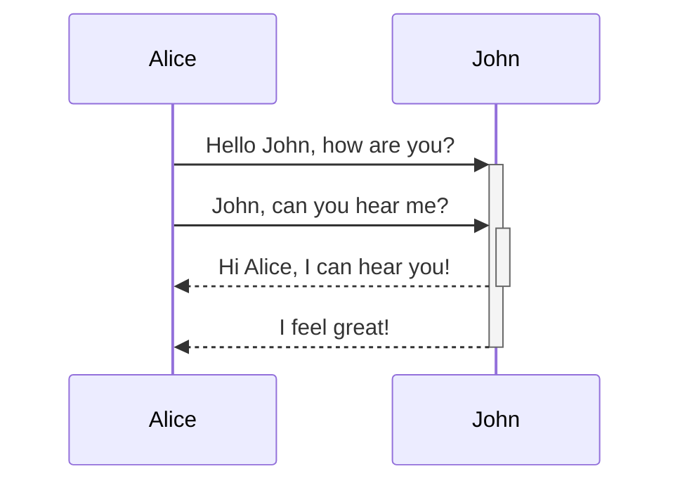

>Markdown is a lightweight markup language for creating formatted text

# Markdown Headings

```
# Heading 1 
## Heading 2 
### Heading 3 
#### Heading 4 
##### Heading 5 
###### Heading 6
```

# Heading 1

## Heading 2

### Heading 3

#### Heading 4

##### Heading 5

###### Heading 6

---
# Text Formatting

- **Bold**
```
**bold**
or Crtl + b
```

- *Italic*
```
*Italic*
or Crtl + i
```

- Strikethrough  ~~Strikethrough ~~
```
 ~~Strikethrough~~
```

- ==Highlight==
```
==Highlight==
or Crtl + i
```

---
# Links

### Link to a Note

The most basic link in Obsidian is a note link, it requires only double square brackets. Obsidian will open a dialog box to help you select the note you want to link to.

```
[[Link to a note]]
```

### Link to a Heading within a Note

```
Link to a [[note's specific heading #Heading]]
```

### Link to a Block within a Note

```
Link to a [[note's specific ^Block]]
```

### Link to a Note but Change the Display text

```
Link to a [[note title | prefered display text]]
```

### Link to a Website

To create a link to an external website, add parenthesis after the square brackets with the URL.

```
[Link to a website](https://facedragons.com)
```
---

### Embedding Images and Other Files

The easiest way to embed a file into your notes is to use ***drag and drop***. Images, videos, audio and other files can be embedded this way. 

_If you haven’t set up a location for your files, you can do so in **Settings>Files & Links>Attachment Folder Path**_

```
![[Image.jpg]]

```

```
![[Video.mp4]]
```

```
![[Audio.mp3]]
```

```
![[Document.pdf]]
```

To link a file that exists online somewhere, enter the URL within parentheses after the link

```

```

Table of supported file types and formats

1.  Markdown files: `md`;
2.  Image files: `png`, `jpg`, `jpeg`, `gif`, `bmp`, `svg`;
3.  Audio files: `mp3`, `webm`, `wav`, `m4a`, `ogg`, `3gp`, `flac`;
4.  Video files: `mp4`, `webm`, `ogv`;
5.  PDF files: `pdf`.

---

### Unordered List (Bullet Points)

-   First Item
-   Second Item
-   Third Item
    -   Tab to embed an item
    -   Continue adding embedded items
-   Shift-Tab to return

```
- First Item
- Second Item
- Third Item
    - Tab to embed an item
    - Continue adding embedded items
- Shift Tab to return
```

### Enumerated List (Numbered List or Ordered List)

1.  First Item
2.  Second Item
3.  Third Item
    1.  Tab to Embed an Item
    2.  Return to continue adding embedded items
4.  Shift-Tab to return

```
1. First Item
2. Second Item
3. Third Item
    1. Tab to Embed an Item
    2. Return to continue adding embedded items
4. Shift Tab to return
```

### Checklist or To-do List

A checklist is a special kind of unordered list, when created it will become a list of clickable checkboxes. It can be tricky to create the first time, here is the exact key you need:

-   **Remember, there is a space after the dash and between the square brackets, otherwise, your checklist won’t work.**

```
- [ ] First Task
- [x] Second Task
- [ ] Third Task
    - [x] Tab to Embed a task
    - [ ] Return to continue adding embedded tasks
- [ ] Shift Tab to return
```

---

## Make Tables

Tables in markdown may look ugly when you are creating them, but they will turn into beautiful and in-proportion tables when you’re finished.

-   **Remember, rows and columns don’t need to be in line in your markdown, they will be fixed after you like off or enable “reading view.”**

```
| Heading | Heading 2 | 
| ----------- | ----------- | 
| First Row | Second Column | 
| Second Row | Second Column|
| Third Row | Second Column |
```

| Heading | Heading 2 | 
| ----------- | ----------- | 
| First Row | Second Column | 
| Second Row | Second Column|
| Third Row | Second Column |

---

## Adding Footnotes

Footnotes will be necessary if you are using Obsidian to do academic work such as essays, theses, or dissertations.

```
Here is a sentence with a ^[This Footnote is found at the bottom of the page] footnote.
```

Here is a sentence with a [1]footnote.

---

## Creating Tags

Tags in Obsidian work in the same way as hashtags on Twitter or Instagram. Tags can be used for categories, genres, or any other way you can think of.

-   Remember, a hash and text (#text) with no space is a tag, and a hash and text with a space between (# text) them is an H1 Heading

```
#tagexample 
```

---

## Adding Code to Your Notes

There are two options for inserting code into your notes, either a code block or `inline code`

### Code Block

A code block is added with any of the following three methods

-   Three tildes on the first and last line of the code block ~~~
-   Three ticks on the first and last line of the code block “`
-   Four spaces

````
~~~
Code block with Tildes
~~~

```
Code Block with ticks
```

    Code Block with four spaces
````

### In-Line Code

```
Insert tick marks around `any text` to turn it into in-line code
```

Insert tick marks around `any text` to turn it into in-line code

---

### Mermaid Embed

